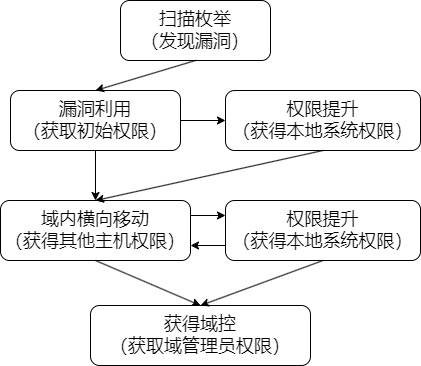

通过前面学习已经把教材里的内容过了一遍，在正式开始靶机实战之前，先梳理一下渗透测试的思路：

上面是一个整体的渗透思路，不管是单机还是AD域都是适用的：

1-扫描枚举：通过端口扫描和服务枚举等方式发现疑似可利用的漏洞，对应第六章和第七章

2-漏洞利用：尝试利用发现的漏洞获得初始权限，包括系统服务漏洞、web漏洞、客户端攻击、口令破解等等方式，对应第八章、第九章、第十章、第十二章、第十三章、第十五章

3-权限提升：获得初始权限后进行本地权限提升获得本地最高权限，对应第十六章、第十七章

4-域内横向移动：通过立足点主机枚举AD信息，进而实施横向移动，对应第二十一章、第二十二章、第二十三章

5-权限提升：技术与3相同

6-获得域控：横向移动获得域控权限，技术与4相同

在整个过程中还涉及到一些通用技术：

1-免杀：针对目标机器上安装了防病毒软件的情况，需要进行免杀，对应第十四章

2-端口转发和隧道：在打域环境靶机的时候，如果靶机不在同一网段，是需要做代理转发或隧道的，对应第十八章、第十九章

3-MSF使用：MSF可以自动化进行漏洞利用以及远程控制，但在考试的时候仅允许针对一台靶机使用MSF的自动化漏洞利用，远程控制则无限制，对应第二十章

后面将主要使用vulnhub靶机进行练习，原因是：

1-免费

2-本地搭建vm可以随时使用

问题是vulnhub基本是没有AD域环境的，大家可以推荐有啥好的域环境靶机一起练习玩耍哈

更多更新资料（微信公众号：TopRedTeam）

